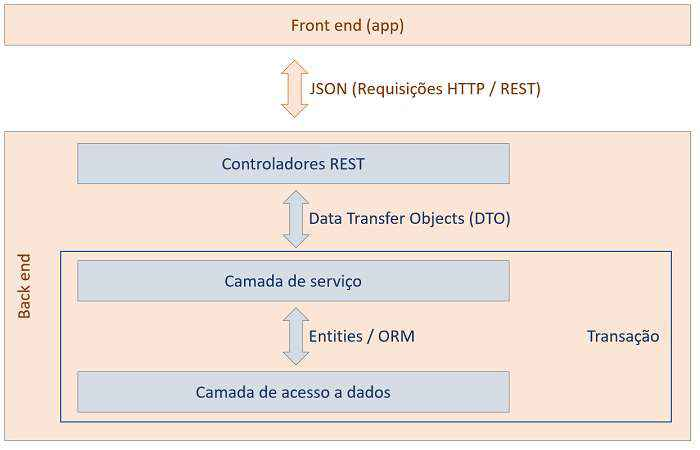
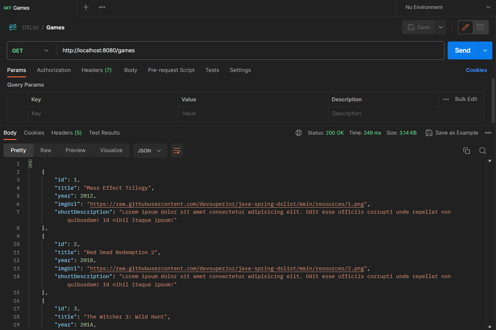

# Projeto DSList - Intensivão Java Spring

## Sobre o projeto

🎮 DSList é uma incrível aplicação Back-end construída durante o Intensivão Java Spring, organizado pela [DevSuperior](https://devsuperior.com.br). 🌟

A proposta da aplicação é ser uma pesquisa de games, onde os usuários podem mergulhar no mundo dos jogos e encontrar informações sobre seus títulos favoritos. 🕹️💻

Com uma pitada de diversão, os usuários têm a liberdade de realizar buscas com base no gênero e classificação dos jogos, para descobrir verdadeiras pérolas dos videogames. 🕵️‍♂️🌟

E não para por aí! A DSList também traz um endpoint especial, permitindo que os jogos sejam organizados de forma personalizada na lista, tornando a experiência única e sob medida para cada usuário. 🔄🎊

Prepare-se para embarcar nessa jornada emocionante e desvendar o universo dos jogos com a DSList! 🚀🎉 

## Modelo conceitual


## Padrão camadas adotado



## Endpoints

### Buscar todos os jogos paginado
```
GET /games
```

### Buscar jogo por id
```
GET /games/{id}
```

### Busca a categoria das listas de jogos
```
GET /lists
```

### Busca uma lista por meio de seu ID mostrando quais jogos estão dentro desta categoria
```
GET /lists/{id}/games
```

## Retorno da API



## Tecnologias utilizadas

### Back end
- [Java 17](https://www.java.com/pt-BR/)
- [Spring Boot](https://spring.io/projects/spring-boot)
- [H2 Console](https://www.h2database.com/html/main.html)
- [JPA / Hibernate](https://hibernate.org/)
- [Maven](https://maven.apache.org/)
- [Postman](https://www.postman.com/)

### Implantação em produção
- Hospedagem: [Railway](https://railway.app/)
- Banco de dados: [PostgreSQL](https://www.postgresql.org/)

## Como executar o projeto

### Pré-requisitos:
- Java 17
- Maven

```bash
# Clonar repositório
git clone https://github.com/rafaelmachadobr/DSList.git

# Entrar na pasta do projeto back end
cd DSList

# Executar o projeto
./mvnw spring-boot:run
```

## Licença

Este projeto está sob a licença MIT. Consulte a [LICENÇA](./LICENSE) para mais informações.
